# Show Media Intake Tool v2

A Windows desktop app for **validating, organizing, and delivering** media files for live events. It checks filenames and technical specs (codec, resolution, framerate, color, audio) against your show requirements, then copies approved files into the right folders—without deleting or moving content already on screens.

Built for operators and producers working with **Pixera**, **PlayBack Pro**, **Mitti**, and similar playback systems.

**Latest release:** [Download v2.2.1](https://github.com/jjpainter1/ShowMediaIntakeTool/releases/latest) (Windows 64-bit zip)

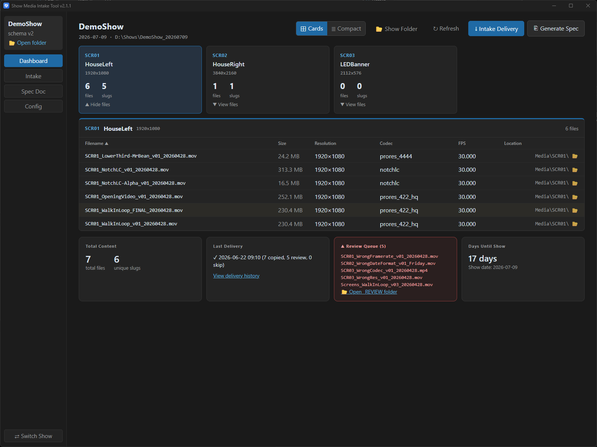

---

## What it does

When content arrives from editors or vendors, the tool acts as an **intake gate**:

1. **Scans** a delivery folder (filenames + ffprobe technical specs).
2. **Compares** each file against the show’s configured requirements.
3. **Reports** what will copy, what has warnings, and what must go to review.
4. **Copies** only after you confirm—using safe temp-then-rename writes.

The tool **never deletes** media and **never moves files already in active screen folders**. Old and new versions can coexist; you handle swaps inside your playback software.

---

## Install (operators)

**Requirements:** Windows 10/11 (64-bit), ~500 MB disk space, internet on first setup (Python install).

1. Download **`ShowMediaIntakeTool-v2.2.1-win64.zip`** from [Releases](https://github.com/jjpainter1/ShowMediaIntakeTool/releases).
2. Extract to a permanent folder (e.g. `C:\Tools\ShowMediaIntakeTool\`).
3. Run **`scripts\setup.cmd`** (first time only).
4. Launch via the **desktop shortcut** — do not double-click the `.exe` alone.

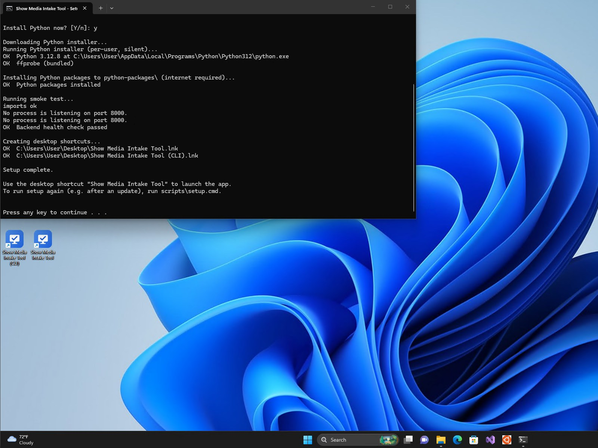

Full install notes, troubleshooting, and uninstall steps: **[README-INSTALL.txt](README-INSTALL.txt)** (included in the release zip).

---

## Features

### Show dashboard

Open a show folder and see at a glance:

- Files per screen, version conflicts, and stale folders
- Days until show date
- Per-file validation status for content already on disk

### Media intake (two-phase)

**Plan → confirm → copy.** You always see a full report before anything is written.

| Mode | When to use | Where files go |
|------|-------------|----------------|
| **Routed** | Filenames include a screen ID (`SCR01`, `SCRwide`, etc.) | `Media/SCR##/` matching the filename |
| **Flat** | Batch delivery without per-file screen tokens | `Media/_INCOMING/` (original filenames kept) |

Strict validation failures route to **`Media/_REVIEW/`**. Warnings copy but are flagged in the report.

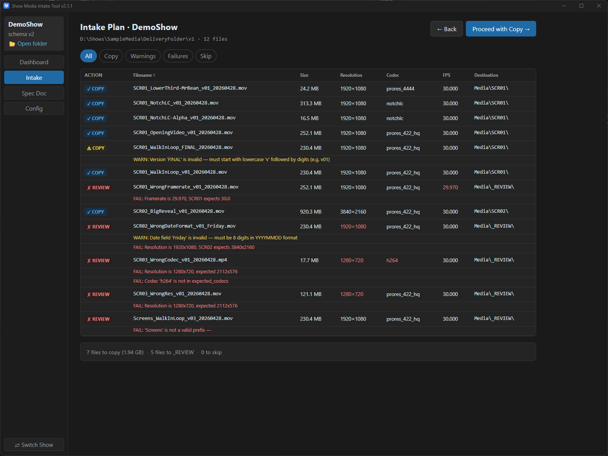

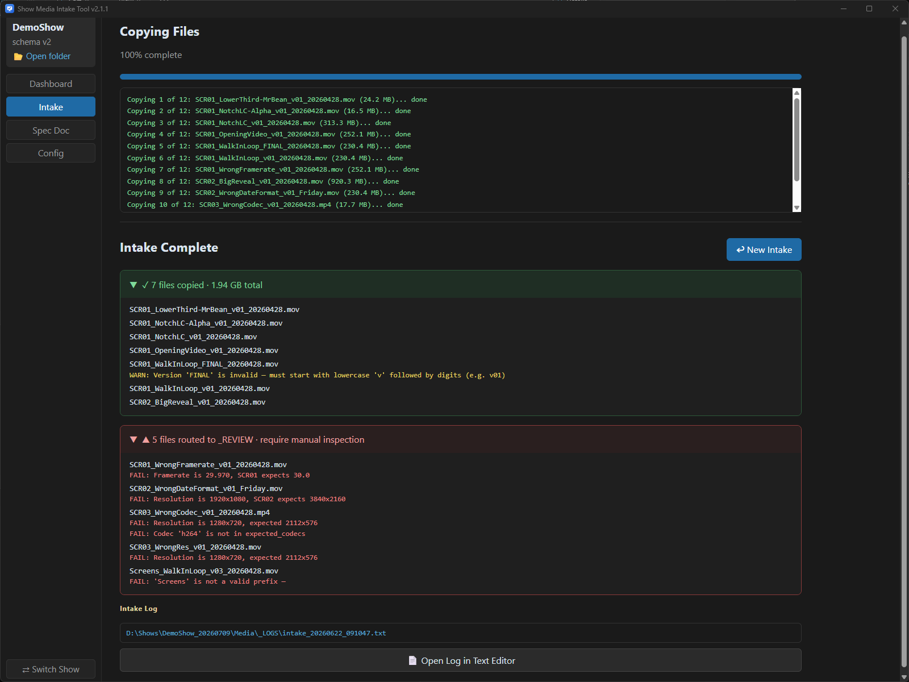

### Config editor

Per-show settings in `show_config.json` (editable in the app):

- Screens, resolutions, and output specs (uniform or **per-screen** for mixed LED/projector rigs)
- Expected codecs (ProRes, NotchLC, H.264, DNxHD, …) and preferred flavors
- **Validation strictness** per field (`strict` / `warn` / `info` / `ignore`)
- **Still images & sequences** — `.jpg`, `.png`, `.tga`, `.tiff`, `.exr`, and numbered frame sequences (resolution validated; codec/framerate/audio skipped for stills)
- **Filename convention** — default pattern or custom token order (show token, screen, content, version, date, …)
- **Presets** for Pixera, PlayBack Pro, Mitti (starting points you can customize)

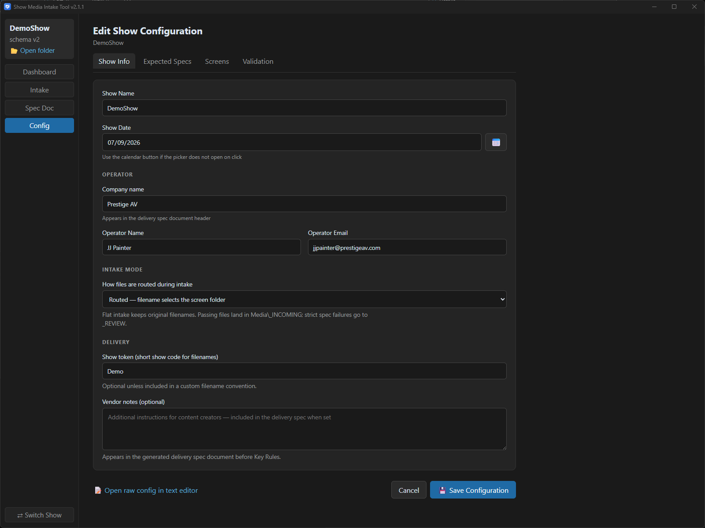

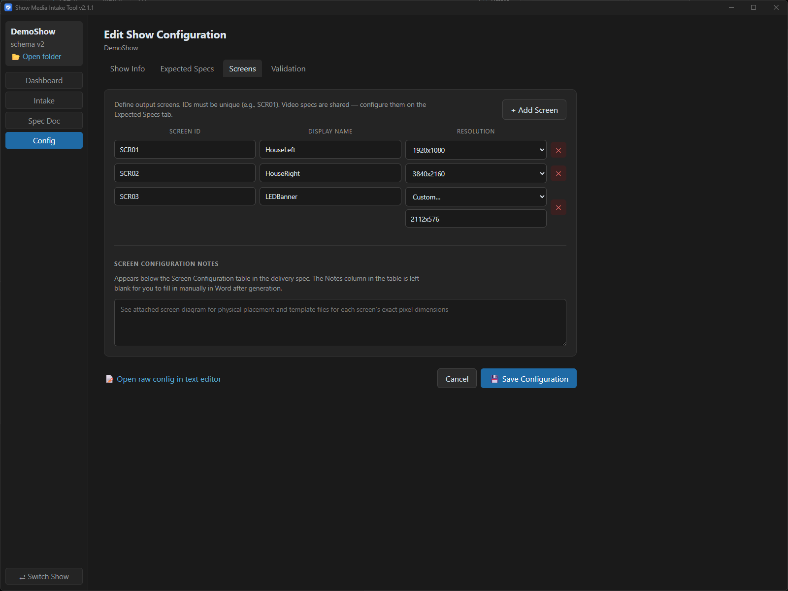

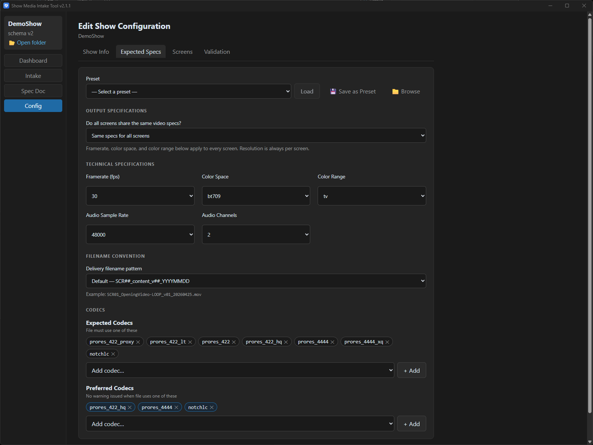

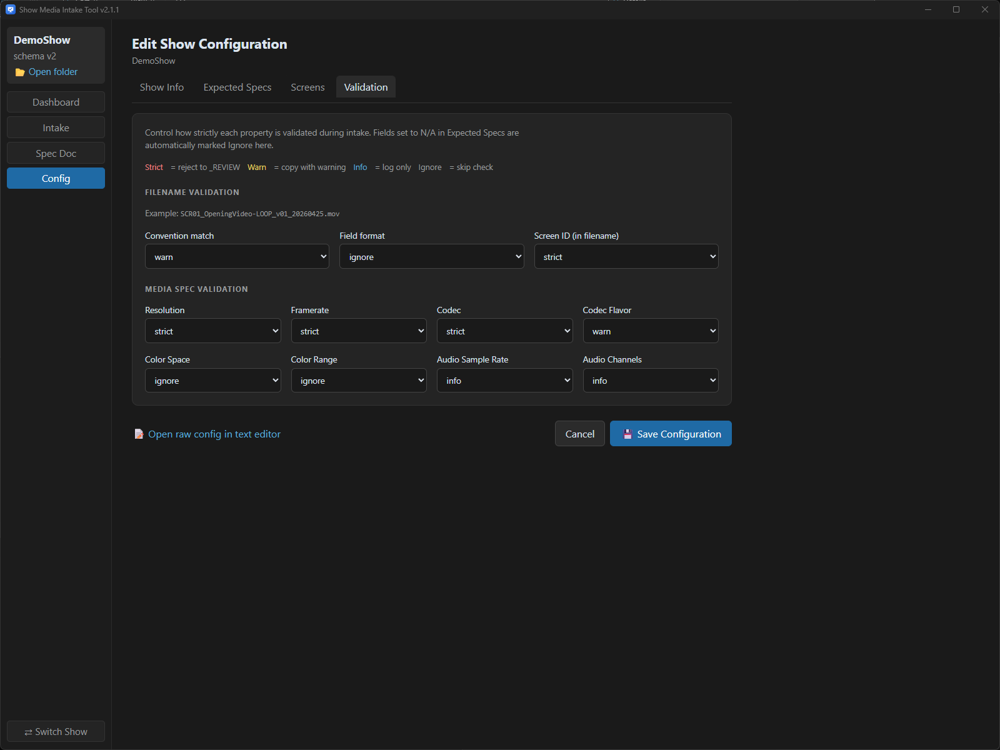

### Delivery spec document

Generate a **Word (.docx)** delivery specification from the show config—ready to send to editors and vendors.

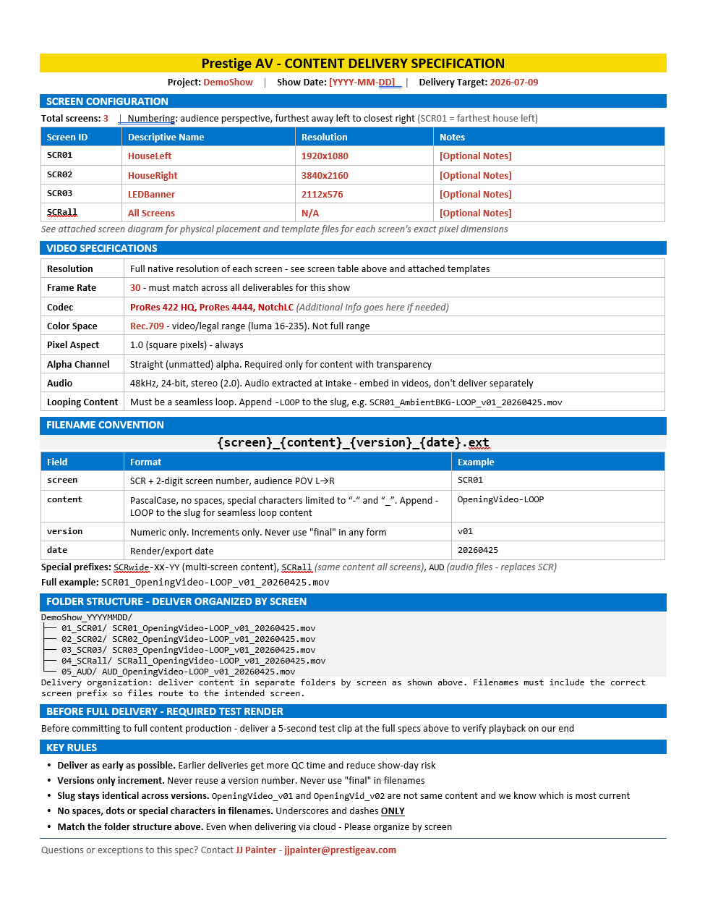

### CLI fallback

Power users can run **`cli_intake.py`** from a terminal or the optional CLI desktop shortcut after setup.

---

## Typical workflow

```
Launch app → Open or create show → Edit Config (screens, specs, validation)
    → Dashboard (check show health)
    → Intake Delivery (pick source folder → review plan → confirm copy)
    → Generate Spec Doc (when sending requirements to vendors)
```

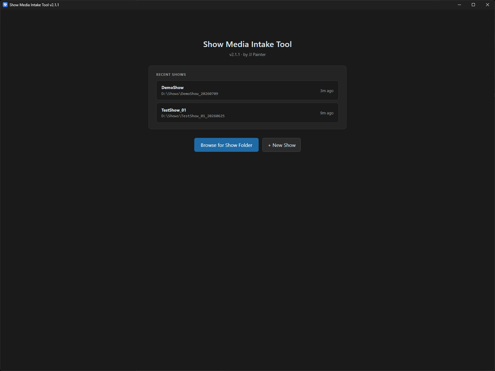

### Show folder layout

Each event is a folder you create (e.g. `D:\Shows\MyShow_20260425\`):

```
MyShow_20260425/
├── show_config.json          # Tool manages; edit in app or Notepad++
├── MyShow.avp                # Your playback project (tool does not touch)
└── Media/
    ├── _LOGS/                # Delivery logs and intake transcripts
    ├── _REVIEW/              # Files that failed strict validation
    ├── _REFERENCE/           # Operator reference materials
    ├── _INCOMING/            # Flat-intake destination
    ├── SCR01/  SCR02/  …     # Per-screen folders (routed intake)
```

---

## Filename convention (routed intake)

Default pattern:

```
SCR##_content_v##_YYYYMMDD.ext
```

Examples: `SCR01_OpeningVideo_v01_20260428.mov`, `SCRwide-01-02-03_Banner_v02_20260428.mov`

With a **custom convention** enabled, you define token order in Config. The parser finds tokens in **any order** in the filename. Original filenames are **never renamed** on copy.

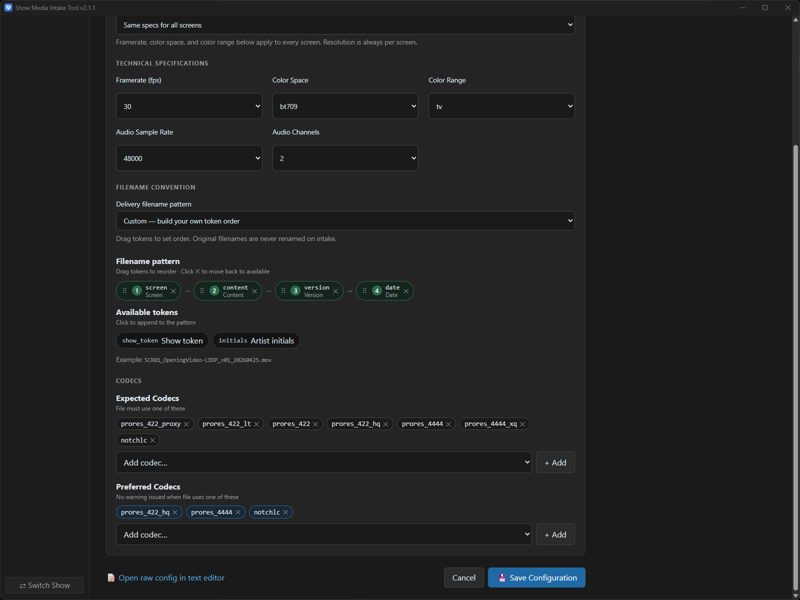

---

## Documentation

| Document | Audience | Contents |
|----------|----------|----------|
| [README-INSTALL.txt](README-INSTALL.txt) | Operators | Install, update, troubleshoot |
| [DEVELOPMENT.md](DEVELOPMENT.md) | Developers | Dev setup, tests, API, building releases |
| [PACKAGING.md](PACKAGING.md) | Developers | Distribution zip layout and scripts |
| [DESIGN-V2.md](DESIGN-V2.md) | Developers | Full UI and workflow specification |
| [CHANGELOG.md](CHANGELOG.md) | Everyone | Release history |
| [AGENT-INTEGRATION.md](AGENT-INTEGRATION.md) | Future | Headless / AI agent integration goals |
| [PROGRESS.md](PROGRESS.md) | Developers | Implementation status |

---

## Known issues

Issues confirmed in real-world use on v2.1.x. Fixes are planned; see [PROGRESS.md](PROGRESS.md) (Planned updates).

| Issue | What you see | Workaround |
|-------|----------------|------------|
| **Launcher terminal stays visible** | A black PowerShell/Terminal window opens when you launch from the desktop shortcut and stays open until you close the app (shows “Starting backend…” / “Backend ready”). | Safe to ignore—the GUI is the app. The window is the launcher script, not the backend. Close it only after closing the app if you want to stop the backend manually. |

---

## License

See [LICENSE](LICENSE). Third-party notices: [THIRD-PARTY-NOTICES.txt](THIRD-PARTY-NOTICES.txt).

## Support

Issues and releases: [github.com/jjpainter1/ShowMediaIntakeTool](https://github.com/jjpainter1/ShowMediaIntakeTool)
